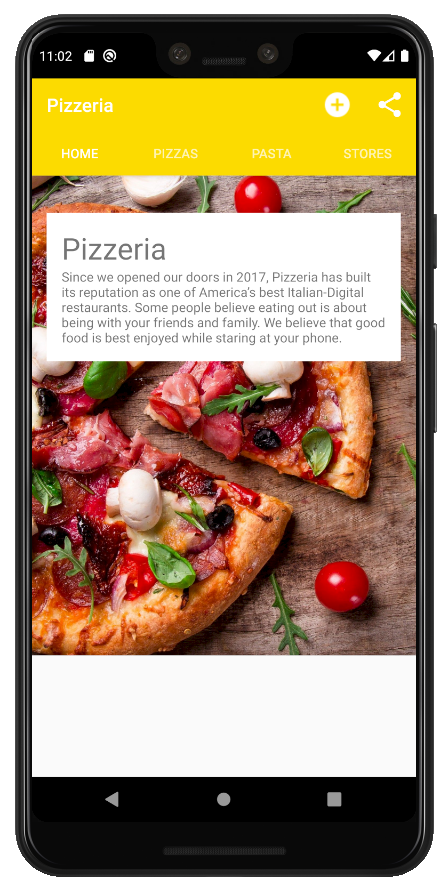
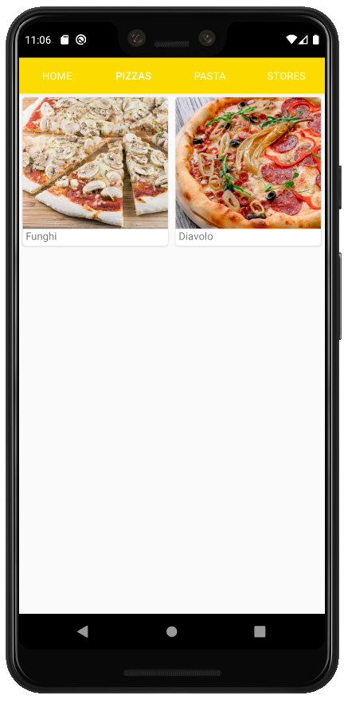

# Pizzeria-app-on-Android
## First Commit

This is the app for a pizzeria on Android.
Not complete. Implemented only the "Create Order" button and share button.
To implement the "Create Order" button, I removed ActionBar and made(wrote) Toolbar instead of ActionBar.
To implement the "Share" button, I used the share action provider. Also, was created menu_main.xml file for 
adding new toolbars.

## Second Commit

In the second commit, I added an icon of pizza for the main activity.
Also was implemented ListView of products in a pizzeria on the main activity(MainActivity.java).
Implemented DrinkCategoryActivity, which shows the category of drinks, and DrinkActivity which shows details of drinks.
Drink class gives information about drinks.

How its look like on the second commit:

## Third Commit

On the third commit, I added a new icon of the drinking bottle on DrinkCategoryActivity. 
Also, added a back button.

How DrinkCategoryActivity looks like on the third commit:

## Fourth Commit
On fourth commit I added the ViewPager.

## Fifth Commit
On the fifth commit, I improved the ViewPager view by adding CardView with RecyclerView.

How its look like:

